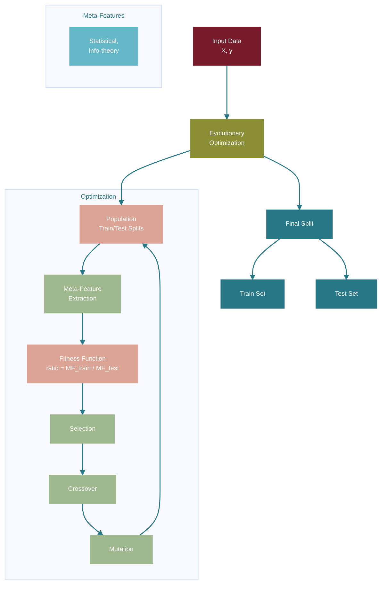
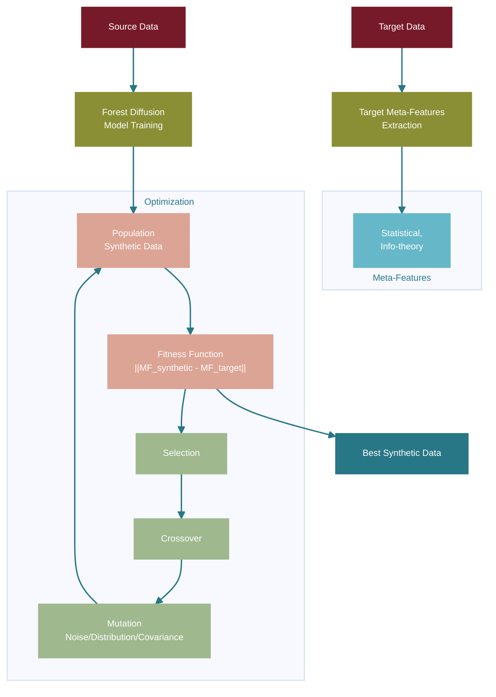

# OOD Tabular Evaluation: Meta-Feature Based Distribution Shift Protocol

## 🔍 Overview

This repository implements a universal, reproducible Out-of-Distribution (OOD) evaluation protocol for tabular data. It uses evolutionary optimization to create train-test splits that maximize meta-feature differences, enabling controlled investigation of model behavior under distributional shifts.


## ✨ Key Features

- **📊 Meta-Feature Based Splitting**: Optimizes data splits using dataset characteristics like mutual information and class concentration
- **🧬 Synthetic Data Generation**: Creates synthetic datasets matching target meta-feature distributions
- **🛡️ Robust Model Evaluation**: Includes IRM and DRO model implementations for OOD testing
- **📈 Comprehensive Benchmarking**: Tests on real-world tabular datasets with known shifts

## 🎯 Problem Statement

In empirical machine learning settings, the core assumption that training and test distributions are identical is often violated. This is particularly challenging in high-stakes domains (medical diagnostics, finance, climate monitoring) where model performance degradation under distributional shifts can have significant real-world implications.

Traditional tabular datasets lack mechanisms for constructing well-defined distributional shifts, making systematic OOD evaluation difficult. This work addresses this gap by introducing a principled protocol that enables controlled manipulation of dataset characteristics.

## 🧠 Methodology

### Proposed Approach

Our approach enhances OOD evaluation through meta-feature based splitting, enabling controlled distributional shifts without architectural changes. Unlike random splits that may not capture meaningful distributional differences, our evolutionary algorithm systematically constructs train-test partitions that maximize meta-feature disparities. The method applies constraints through the fitness function rather than modifying the data generation process, maintaining dataset integrity while enforcing interpretable geometric relationships. Additionally, our framework supports synthetic data generation that preserves specific meta-feature distributions, allowing researchers to create controlled datasets with desired statistical properties for comprehensive robustness testing. This dual capability of both optimized splitting and targeted synthetic generation provides a complete toolkit for systematic OOD evaluation in tabular domains.

## 1️⃣ Meta-Feature Based Splitting

The core idea is formulating train-test partitioning as an optimization problem:

```
maximize: [mean(meta_feature₁(train))/mean(meta_feature₁(test)), ..., mean(meta_featureₙ(train))/mean(meta_featureₙ(test))]
subject to: |test_set| = α × |dataset|
```

Where meta-features include, for example:

 ℹ️ **Info-theory:**
 
- **Attribute Entropy** (`attr_ent`): Measures feature distribution complexity
- **Class Concentration** (`class_conc`): Quantifies class imbalance
- **Mutual Information** (`mut_inf`): Captures feature-target relationships
- **Interquartile Range** (`iq_range`): Describes distribution spread
  
 🔢 **Statistical:**
- **Joint Entropy** (`joint_ent`): Measures overall dataset complexity
- **Kurtosis** (`kurtosis`): Measures distribution tail heaviness
- **Eigenvalues** (`eigenvalues`): Captures data structure variance

### Evolutionary Algorithm

The optimization uses a genetic algorithm with:
- **Population**: Binary vectors representing train/test assignments
- **Fitness**: Euclidean distance between meta-feature vectors
- **Selection**: Tournament selection with elitism
- **Crossover**: Uniform crossover with repair mechanisms
- **Mutation**: Swap operations maintaining test set size

### Approach Diagram




### 📊 Experimental Results: Train/Test Split Analysis

📌 **Bold** indicates best result in category
| Split type | Dataset | LR | XGB | IRM | DRO |
|--------|---------|----|-----|-----|-----|
| **Random Split**| taxi | 0.752 ± 0.01 | 0.778 ± 0.01 | 0.790 ± 0.02 | 0.712 ± 0.02 |
| **Class_conc** | taxi | **0.526** ± 0.10 | **0.592** ± 0.07 | **0.773** ± 0.10 | **0.505** ± 0.10 |
| **Random Split** | electricity | 0.798 ± 0.00 | 0.832 ± 0.00 | 0.813 ± 0.01 | 0.814 ± 0.02 |
| **Mut_inf** | electricity | **0.735** ± 0.02 | **0.749** ± 0.01 | **0.795** ± 0.02 | **0.766** ± 0.01 |


## 2️⃣ Synthetic Data Generation

The synthetic generation approach formulates data creation as an optimization problem:
```
minimize: ||meta_features(synthetic) - meta_features(target)||₂
subject to: synthetic ∈ feasible_space(source)
```
### Approach Diagram



### 📊 Experimental Results: Synthetic Data Generation Analysis

Performance on synthetic data generated with optimized meta-features:

| Dataset | LR | XGB | DRO | IRM |
|---------|----|-----|-----|-----|
| **electricity** (mut-inf, class-conc, iq-range) | 0.613 ± 0.08 | 0.641 ± 0.09 | 0.587 ± 0.08 | 0.613 ± 0.08 |
| **electricity** (mut-inf, class-conc) | 0.611 ± 0.01 | 0.625 ± 0.01 | 0.589 ± 0.01 | 0.632 ± 0.02 |

## 🚀 Quick Start

### Installation

```bash
# Clone the repository
git clone https://github.com/ITMO-NSS-team/OOD_Tab_Evaluation.git
cd OOD_Tab_Evaluation

# Install dependencies
pip install -r requirements.txt
```

## 🔧 Reproducing Experiments

### 1. Download Datasets

The repository includes several tabular datasets with known distributional shifts:

```
data/
├── electricity_source.csv      # Source domain data
├── electricity_target.csv      # Target domain data
...
├── taxi_source.csv
└── taxi_target.csv
```


### 2. Run Meta-Feature Splitting
```python
from mfs_split.mfs_split import run_split
import pandas as pd

# Load your data
data = pd.read_csv('your_data.csv')

# Run split optimization
run_split(
    file=data,
    target_column_name='target',  # Your target column name
    file_prefix_name='split_by_class_conc',  # Output file prefix
    meta_features=['class_conc'],  # Meta-feature to optimize
    population_size=50,
    generations=300
)
```
### 3. Run Synthetic Data Generation
```python
from mfs_split.mfs_synthetic import run_shift_convergence_experiment

# Generate synthetic data
results = run_shift_convergence_experiment(
    meta_features=['class_conc', 'mut_inf'],  # Meta-features to match
    mutation_type='all',  # Mutation strategy
    n_samples=dataset_length, # Number of samples to generate
    generations=200,
    source_file='data/source.csv',
    target_file='data/target.csv'
)
```

## 📁 Repository Structure

```
OOD_Tab_Evaluation/
├── mfs_split/                    # Meta-feature splitting algorithms
│   ├── mfs_split_alg.py         # Basic evolutionary algorithm
│   ├── mfs_split.py             # Advanced DEAP-based implementation
│   └── mfs_synthetic.py         # Synthetic data generation
├── robust_models/               # Robust model implementations
│   ├── IRM_model/              # Invariant Risk Minimization
│   │   └── IRMClassifier.py
│   └── DRO_model/              # Distributionally Robust Optimization
│       ├── DROClassifier.py
│       └── AdversarialDRO.py
├── baselines/                   # Baseline methods
│   └── worst_case_subpopulation.py
├── data/                        # Dataset files
├── experiments/                 # Experimental notebooks
│   └── test_robust_models.ipynb
├── test_mfs_split.ipynb        # Main evaluation notebook
└── README.md                   # This file
```

## 🎯 Key Findings

1. **Controlled OOD Evaluation**: Meta-feature based splits enable systematic investigation of model behavior under distributional shifts
2. **Robust Model Performance**: IRM and DRO models show varying degrees of robustness across different shift types
3. **Interpretable Shifts**: Meta-features provide semantic interpretation of distributional differences
4. **Reproducible Protocol**: The evolutionary approach ensures consistent and reproducible OOD evaluation

## 📚 Dependencies

- `numpy>=1.21.0`
- `pandas>=1.3.0`
- `scikit-learn>=1.0.0`
- `torch>=1.9.0`
- `xgboost>=1.5.0`
- `deap>=1.3.0`
- `pymfe>=0.4.0`
- `matplotlib>=3.5.0`


## 📖 Citation

If you use this code in your research, please cite:

```bibtex
@article{ood_tabular_evaluation,
  title={Meta-Feature Based Distribution Shift Protocol for Tabular Data},
}
```

## 📞 Contact

For questions or feedback, please open an issue on GitHub or contact the maintainers.
