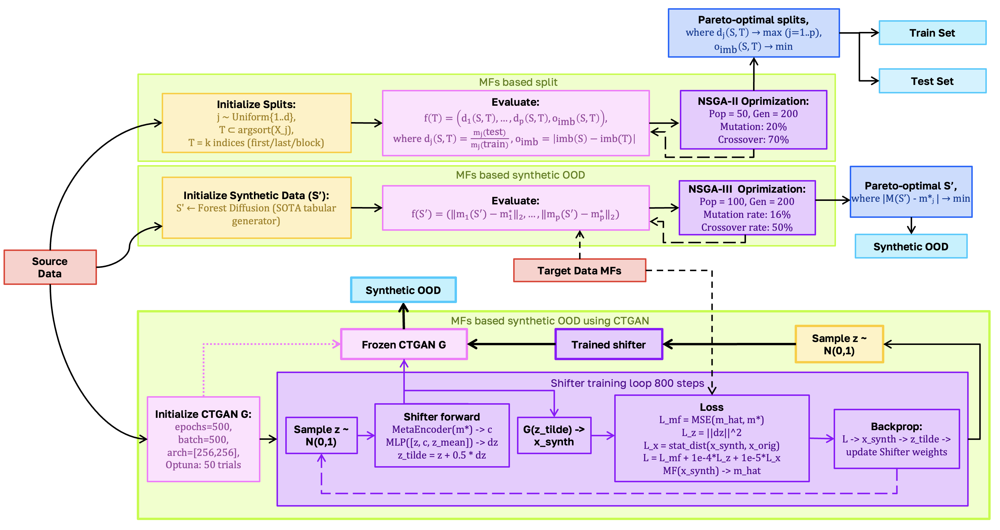

# OOD Tabular Evaluation: Meta-Feature Based Distribution Shift Protocol

A unified protocol for **proxy out-of-distribution (OOD) evaluation** of tabular ML models when the true target sample is unavailable but representable through a small set of dataset-level meta-features (mutual information, class concentration, joint entropy, IQ-range, attribute entropy).

The protocol is realized as **three complementary branches** sharing the same idea — meta-features as explicit shift targets — with progressively stronger forms of control.

| # | Branch | Search space | Optimizer | Code |
|---|--------|-------------|-----------|------|
| 1 | **Meta-feature based splitting** | train/test partitions of the source data | NSGA-II (DEAP) | [`mfs_based_algs/evo_based_algs/mfs_split.py`](mfs_based_algs/evo_based_algs/mfs_split.py) |
| 2 | **Synthetic OOD generation** | source-informed synthetic tabular datasets | NSGA-III + ForestDiffusion prior | [`mfs_based_algs/evo_based_algs/mfs_synthetic.py`](mfs_based_algs/evo_based_algs/mfs_synthetic.py) |
| 3 | **CTGAN latent steering (Shifter)** | latent noise distribution of a frozen CTGAN | gradient-based via differentiable meta-features | [`mfs_based_algs/CTGAN_shifter/`](mfs_based_algs/CTGAN_shifter/) |



*All three branches consume the same source data and the same target meta-feature profile, but operate over different search spaces — index subsets (NSGA-II), synthetic datasets initialized by Forest Diffusion (NSGA-III), and the latent noise distribution of a frozen CTGAN (gradient-based Shifter).*

For details see the per-branch READMEs:
- [`mfs_based_algs/evo_based_algs/README.md`](mfs_based_algs/evo_based_algs/README.md) — evolutionary branches (1 + 2)
- [`mfs_based_algs/CTGAN_shifter/README.md`](mfs_based_algs/CTGAN_shifter/README.md) — latent-steering branch (3)

---

## Repository structure

```
OOD_Tab_Evaluation/
├── README.md                                # This file
├── assets/architecture.png                  # Diagram embedded in this README
├── evaluate_reconstruction.py               # Source-target boundary recovery (ARI)
├── data/                                    # *_source.csv / *_target.csv pairs
│   ├── electricity_source.csv    electricity_target.csv
│   ├── california_source.csv     california_target.csv
│   ├── taxi_source.csv           taxi_target.csv
│   ├── income_source.csv         income_target.csv
│   ├── acs_accidents_source.csv  acs_accidents_target.csv
│   ├── diab_s_source.csv         diab_s_target.csv         # diabetes split-18
│   ├── eicu_source.csv           eicu_target.csv           # eICU ethnicity=caucasian
│   └── mimic_source.csv          mimic_target.csv          # MIMIC careunit=MICU
├── robust_models/                           # Robust downstream models for OOD testing
│   ├── IRM_model/IRMClassifier.py           # Invariant Risk Minimization
│   └── DRO_model/{DROClassifier,AdversarialDRO}.py
└── mfs_based_algs/
    ├── evo_based_algs/                      # Branches 1 + 2 (evolutionary)
    │   ├── README.md
    │   ├── mfs_split.py                     # Branch 1: NSGA-II over train/test splits
    │   ├── mfs_synthetic.py                 # Branch 2: NSGA-III over synthetic datasets
    │   └── iris_demo.ipynb                  # End-to-end demo (split + synth) on Iris
    └── CTGAN_shifter/                       # Branch 3 (latent steering)
        ├── README.md
        ├── shifter/
        │   ├── src/{shifter,differentiable_mfe,ctgan_adapter}.py
        │   └── example/                     # Pretrained checkpoint + demo notebook
        ├── preprocessing/tab_preprocessing.py
        └── external/ctgan_repo/             # Vendored CTGAN
```

---

## Quick start

```bash
git clone https://github.com/ITMO-NSS-team/OOD_Tab_Evaluation.git
cd OOD_Tab_Evaluation

pip install numpy pandas scikit-learn matplotlib seaborn \
            deap pymfe torch xgboost
# Branch 2 (synthesis prior): https://github.com/SamsungSAILMontreal/ForestDiffusion
pip install ForestDiffusion
# Branch 3 (vendored CTGAN under mfs_based_algs/CTGAN_shifter/external/ctgan_repo)
pip install -e mfs_based_algs/CTGAN_shifter/external/ctgan_repo
```

### Branch 1 — Meta-feature-based split

```python
import pandas as pd
from mfs_based_algs.evo_based_algs.mfs_split import run_split

data = pd.read_csv("data/electricity_source.csv")

run_split(
    file=data,
    target_column_name="class",
    file_prefix_name="split_by_class_conc",
    meta_features=["class_conc"],
    population_size=50,
    generations=300,
)
```

Output directory `split_by_class_conc_pareto_solutions/` contains per-solution train/test CSVs, an info file, and a Pareto-front summary.

### Branch 2 — Synthetic OOD generation

```python
from mfs_based_algs.evo_based_algs.mfs_synthetic import run_shift_convergence_experiment

run_shift_convergence_experiment(
    shift_type="electricity_class_conc_mut_inf",
    meta_features=["class_conc", "mut_inf"],
    mutation_type="all",                       # noise / distribution / covariance / all
    n_samples=500,
    generations=100,
    source_file="data/electricity_source.csv",
    target_file="data/electricity_target.csv",
)
```

Synthetic data, convergence plots, and pair-plots are saved under `synthetic_data/shift_<shift_type>/<mutation_type>/`.

### Demo notebook for branches 1 + 2

[`mfs_based_algs/evo_based_algs/iris_demo.ipynb`](mfs_based_algs/evo_based_algs/iris_demo.ipynb) walks through the full pipeline on Iris: random split → MF-split (`mut_inf`) → MF-targeted synthesis (`mut_inf` + `iq_range`) with pair-plots and a distance-to-target summary.

### Branch 3 — CTGAN Shifter

End-to-end training of the Shifter against a frozen CTGAN is documented separately in [`mfs_based_algs/CTGAN_shifter/README.md`](mfs_based_algs/CTGAN_shifter/README.md). A ready demo with a pretrained checkpoint is in [`mfs_based_algs/CTGAN_shifter/shifter/example/shifter_electricity_demo.ipynb`](mfs_based_algs/CTGAN_shifter/shifter/example/shifter_electricity_demo.ipynb).

### Source-target boundary recovery (validation experiment)

After at least one Branch 1 run has produced a `split_by_*_pareto_solutions/` directory:

```bash
python evaluate_reconstruction.py
```

The script reports the Adjusted Rand Index between the reconstructed split and the ground-truth source/target labels for every available dataset in `data/`.

---

## Dependencies

- `numpy>=1.21`, `pandas>=1.3`, `scikit-learn>=1.0`
- `deap>=1.3`, `pymfe>=0.4` (evolutionary branches)
- `torch>=1.9`, `xgboost>=1.5` (downstream and Shifter)
- `matplotlib>=3.5`, `seaborn` (diagnostics)
- ForestDiffusion (synthesis prior, Branch 2)
- CTGAN (Branch 3)
