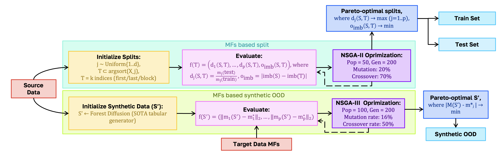

# Branch 3 — CTGAN Shifter (Latent Steering)

> A neural module for **meta-feature-conditioned latent-space steering** of a pretrained CTGAN — generating tabular data with user-specified statistical properties without retraining the generator.

This is the third branch of the OOD evaluation protocol. The two evolutionary branches (split + synthesis) are implemented in [`../evo_based_algs/`](../evo_based_algs/); the high-level overview is in the [project README](../../README.md).

---

## How it works

Standard CTGAN samples noise `Z ~ N(0, I)` and passes it through a frozen generator. **Shifter** learns to apply a small, targeted shift to `Z` so that the generated data matches a desired set of meta-features `m*`. The CTGAN weights are **frozen throughout** — only Shifter is trained.

The shift is a residual correction:

$$\tilde{z}_i = z_i + \delta_{\text{scale}} \cdot \Delta_\theta\bigl([z_i,\ c,\ \mu_Z]\bigr)$$

- `c = MetaEncoder(m*)` — encodes target meta-features into a conditioning vector
- `μ_Z = mean(Z)` — permutation-invariant batch summary (Deep-Sets-style context)
- `Δ_θ` — MLP predicting a per-sample shift
- `δ_scale` — shift magnitude hyperparameter



*The Shifter is the only trainable module: a CTGAN generator `G` is pretrained on the source and frozen. During training (purple loop) fresh noise `z` is shifted to `z_tilde`, decoded into `x_synth = G(z_tilde)`, scored by the joint loss `L = L_mf + 1e-4·L_z + 1e-5·L_x`, and used to update Shifter weights via backprop. At inference (top of the figure) the same trained Shifter steers `z ~ N(0, I)` so that the frozen `G` produces a synthetic OOD dataset whose meta-features match the requested target `m*`.*

---

## Training loop

1. **Pretrain CTGAN** on source data, then freeze all its weights.
2. **Train Shifter** end-to-end through the frozen generator:
   1. sample fresh noise: `Z = torch.randn(N, z_dim)`,
   2. compute shifted noise: `Z̃ = shifter(Z, m*)`,
   3. generate data differentiably: `X̃ = adapter.generate_from_noise_differentiable(Z̃)`,
   4. compute differentiable meta-features: `m̂ = compute_diff_mfs(X̃)`,
   5. backpropagate through Shifter only.

Loss:

$$\mathcal{L} = \underbrace{\text{MSE}(\hat{m},\ m^*)}_{\text{meta loss}} + \lambda_Z \cdot \underbrace{\|\tilde{Z} - Z\|^2}_{\text{latent reg}} + \lambda_X \cdot \underbrace{\|\tilde{X} - X_{\text{base}}\|^2}_{\text{feature reg}}$$

---

## Repository layout

```
CTGAN_shifter/
├── README.md                                     # This file
├── assets/architecture.png                       # Diagram embedded in this README
├── simple_experiment.ipynb                       # End-to-end demonstration
├── shifter/
│   ├── src/
│   │   ├── shifter.py                            # Shifter network (Δ_θ + MetaEncoder)
│   │   ├── differentiable_mfe.py                 # Differentiable meta-feature extractor
│   │   └── ctgan_adapter.py                      # Adapter: differentiable noise → data
│   └── example/
│       ├── shifter_electricity_demo.ipynb        # Runnable demo with checkpoints
│       ├── shifter.pt                            # Pretrained Shifter weights
│       ├── trained_ctgan_iris.pkl                # Pretrained CTGAN backbone
│       └── synthetic_shifted.csv                 # Reference output
├── preprocessing/
│   └── tab_preprocessing.py                      # Mixed-type tabular preprocessing
└── external/
    └── ctgan_repo/                               # Vendored CTGAN (frozen generator)
```

---

## Quick demo

The simplest way to inspect the branch is to open the demo notebook:

```bash
jupyter notebook mfs_based_algs/CTGAN_shifter/shifter/example/shifter_electricity_demo.ipynb
```

It loads `trained_ctgan_iris.pkl` + `shifter.pt`, samples noise, applies the Shifter, and writes the steered synthetic dataset to `synthetic_shifted.csv` for inspection.

The end-to-end training pipeline (CTGAN pretraining → Shifter optimization → evaluation) is shown in [`simple_experiment.ipynb`](simple_experiment.ipynb).

---

## Differentiable meta-features supported by the Shifter

`shifter/src/differentiable_mfe.py` implements PyTorch versions of the following descriptors, used as targets `m*`:

- `mean`, `sd`, `var` — per-column statistical summaries;
- `attr_ent` — attribute entropy (continuous / categorical);
- `joint_ent` — joint entropy of feature--target.

Non-differentiable descriptors (`mut_inf`, `class_conc`, `iq_range`) remain specific to the evolutionary branches.
