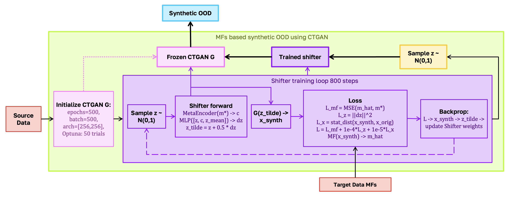

# Evolutionary Branches: Meta-Feature-Based Splitting and Synthesis

This directory implements the two **evolutionary** branches of the OOD evaluation protocol. Both branches share the same core idea — formulate proxy OOD construction as multi-objective optimization with meta-features as explicit shift targets — but operate over different search spaces.

| File | Branch | Search space | Optimizer |
|------|--------|-------------|-----------|
| [`mfs_split.py`](mfs_split.py) | Meta-feature-based splitting | train/test partitions of the source dataset | **NSGA-II** (DEAP) |
| [`mfs_synthetic.py`](mfs_synthetic.py) | Synthetic OOD generation | source-informed synthetic tabular datasets | **NSGA-III** with a ForestDiffusion prior |
| [`iris_demo.ipynb`](iris_demo.ipynb) | End-to-end demo on Iris | random split → MF-split → MF-targeted synthesis | NSGA-II + NSGA-III |



*Both branches share the same source data and target meta-feature profile. **MFs-based split** (top) searches index subsets `T ⊂ argsort(X_j)` with NSGA-II using the meta-feature ratio vector `(d_1(S,T), …, d_p(S,T))` and a class-imbalance penalty `o_imb`. **MFs-based synthetic OOD** (bottom) initializes a synthetic dataset `S'` with Forest Diffusion and refines it with NSGA-III against `‖m_j(S') − m_j*‖₂` for each meta-feature.*

The third branch — CTGAN-based latent steering — is implemented separately in [`../CTGAN_shifter/`](../CTGAN_shifter/).

---

## Branch 1: `mfs_split.py` — meta-feature-based splitting

Formulates train/test partitioning as a multi-objective optimization problem:

```
maximize   ( m_1(train) / m_1(test), …, m_k(train) / m_k(test) )
subject to |test| = α · N,  class-balance constraint
```

Each individual is a list of test indices; mutation replaces a random subset of indices with currently-unselected ones; crossover swaps non-overlapping indices between two parents.

### Entry point

```python
from mfs_based_algs.evo_based_algs.mfs_split import run_split
import pandas as pd

data = pd.read_csv("data/electricity_source.csv")

run_split(
    file=data,
    target_column_name="class",
    file_prefix_name="split_by_class_conc",
    meta_features=["class_conc"],   # any subset of pymfe descriptors
    population_size=50,
    generations=300,
)
```

### Output

`split_by_<prefix>_pareto_solutions/` containing, per Pareto solution `XX`:

```
split_by_<prefix>_solution_XX_train.csv
split_by_<prefix>_solution_XX_test.csv
split_by_<prefix>_solution_XX_info.txt
pareto_solutions_summary.csv          # one row per solution, all objectives
```

A convergence plot is saved at the same level.

---

## Branch 2: `mfs_synthetic.py` — synthetic OOD generation

Formulates synthetic data construction as a multi-objective search:

```
minimize  ‖ M(synthetic) − m* ‖₂   per meta-feature
subject to synthetic ∈ feasible_space(source, ForestDiffusion)
```

Each individual is a flattened synthetic dataset; the initial population is sampled from a **ForestDiffusion** model fitted on the source. Three mutation operators are alternated (`mutation_type` argument):

- `noise` — Gaussian perturbation of continuous columns + per-column categorical resampling;
- `distribution` — resampling of continuous columns from a fitted GMM;
- `covariance` — multivariate-normal resampling preserving the empirical covariance of continuous columns;
- `all` — one of the three is chosen per individual.

Crossover swaps either entire rows or entire columns between two parents.

### Entry point

```python
from mfs_based_algs.evo_based_algs.mfs_synthetic import run_shift_convergence_experiment

run_shift_convergence_experiment(
    shift_type="electricity_classconc_mutinf",
    meta_features=["class_conc", "mut_inf"],
    mutation_type="all",
    n_samples=500,
    generations=100,
    source_file="data/electricity_source.csv",
    target_file="data/electricity_target.csv",
)
```

### Output

```
synthetic_data/shift_<shift_type>/<mutation_type>/
├── synthetic_data_<mutation_type>.csv      # final synthetic dataset
├── convergence_<mutation_type>.png         # per-meta-feature convergence
└── pairplot_<mutation_type>.png            # source / target / synthetic comparison
```

---

## End-to-end demo: `iris_demo.ipynb`

A self-contained notebook that exercises both branches on the Iris dataset:

1. random train/test split as a baseline pair-plot;
2. MF-based split with `EvolutionarySplitOptimizer` targeting `mut_inf`;
3. MF-targeted synthesis with `generate_synthetic_data` (NSGA-III) reproducing the
   `mut_inf` and `iq_range` profile of the MF-split test set;
4. summary table of L2 distances between source / synthetic and the target
   meta-feature vectors.

Run it from this directory so the local imports `mfs_split` and `mfs_synthetic` resolve:

```bash
cd mfs_based_algs/evo_based_algs
jupyter notebook iris_demo.ipynb
```
